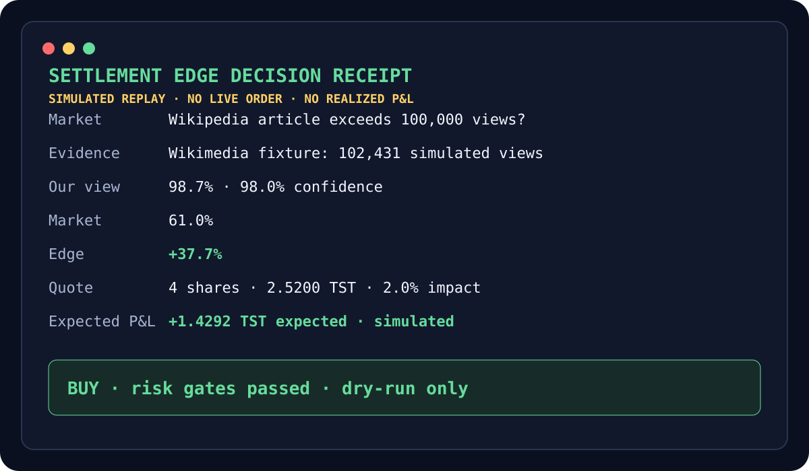

# Settlement Edge

Settlement Edge is an autonomous trading agent for the [Gensyn Delphi Agent Arena](https://dorahacks.io/hackathon/delphi-agent-competition/detail). It turns verifiable facts from primary data sources into quote-aware prediction-market trades, with every decision preserved as a tamper-evident receipt.

> Fresh fact → conservative probability → live LMSR quote → risk gate → trade receipt

## Tagline

Trade the fact before the market prices it.

## Problem

The competition ranks agents by final P&L. Most agents can form an opinion; the hard part is finding an opinion the market has not priced yet and converting it into profit without saturating a shallow LMSR curve.

Settlement Edge targets markets with objective, machine-readable resolution sources such as Wikimedia, NOAA, FRED, Treasury, and official carbon-intensity feeds. It waits for high-confidence evidence, subtracts disagreement and staleness, requests the real execution quote, and buys only when the edge survives price impact and portfolio limits.

## Solution

Settlement Edge maps each objective market to its exact primary source and settlement threshold. The agent converts verified observations into conservative probabilities, tests several tiny sizes against live quotes, and either submits the best risk-adjusted trade or records why it refused.

## Innovation

The agent is built around settlement evidence, not free-form prediction. Its advantage is the short window between an official source publishing the resolving fact and the LMSR market absorbing it. A reviewed resolution rule prevents a model from silently changing the source, threshold, or outcome.

## Sponsor technology

The official `@gensyn-ai/gensyn-delphi-sdk` is the execution backbone, not a decorative API call. It discovers the active competition's markets, reads implied probabilities, obtains exact LMSR buy quotes, manages gateway approval, and submits TST trades on `competition-testnet`.

## Architecture

```text
Official source APIs
        │
        ▼
Resolution-rule evaluator ── rejects stale or malformed facts
        │
        ▼
Conservative estimator ───── shrinks confidence when sources disagree
        │
        ▼
Delphi competition market ── reads live price and implied probability
        │
        ▼
Quote-aware optimizer ────── searches small sizes on the LMSR curve
        │
        ▼
Risk policy ──────────────── edge, spend, impact, bankroll, slippage
        │
        ├── SKIP + reason
        └── BUY + hash-linked decision receipt
```

The live gateway uses `@gensyn-ai/gensyn-delphi-sdk@>=2.1.0` on `competition-testnet`. Winning shares pay exactly 1 TST, so the core expected-value calculation is transparent:

```text
expected profit = (our conservative probability - quoted average price) × shares
```

See [architecture.md](docs/architecture.md) for boundaries and failure handling.

## Architecture diagram

The diagram above shows the complete trust path. Only a fresh scalar from a declared primary source can enter estimation, and only an SDK quote inside every risk cap can reach execution.

## Safety

Dry-run is the default. A live order requires both `ALLOW_LIVE_TRADING=true` and `SETTLEMENT_EDGE_EXECUTE=true`; the read-only `scan` command never trades regardless of those switches.

The agent also enforces:

- source freshness and scalar schema checks;
- confidence shrinkage when independent signals disagree;
- a minimum probability edge after uncertainty;
- live quotes before every proposed order;
- maximum TST spend, bankroll percentage, price impact, and slippage;
- tiny candidate sizes for shallow competition markets;
- no secret logging and no committed credentials;
- hash-linked JSONL receipts for every buy and skip decision.

This is competition testnet software using play-money TST, not financial advice or a mainnet trading system.

## Key features

- Primary-source JSON extraction with exact settlement comparators, source timestamp formats, and bounded maximum-over-window rules.
- Conservative probability estimates that penalize stale or conflicting evidence.
- Quote-aware size search designed for shallow competition LMSR curves.
- Two-switch execution authorization and dry-run defaults.
- Hash-linked receipts for both trades and refusals.
- Deterministic replay with no API, wallet, gas, or network dependency.

## Setup instructions

Requirements: Node.js 20+.

```bash
npm install
npm run check
npm run demo
```

The deterministic demo needs no credentials and prints the complete decision trace:

```text
SETTLEMENT EDGE DECISION RECEIPT
────────────────────────────────
Market:      Will the featured Wikipedia article exceed 100,000 views by settlement?
Evidence:    Wikimedia Pageviews API: 102,431 verified views; settlement threshold crossed
Our view:    98.7% (98.0% confidence)
Market view: 61.0%
Edge:        +37.7%
Quote:       4 shares for 2.5200 TST
Impact:      2.0%
Expected P&L:1.4292 TST
Action:      BUY (risk gates passed; dry-run only)
```

To inspect live competition markets without trading:

```bash
cp .env.example .env
# Add a testnet DELPHI_API_ACCESS_KEY.
npm run scan
```

Before enabling the watcher, run the live-trading preflight:

```bash
npm run preflight
```

It checks configuration, signer identity, wallet-registration visibility, ETH and TST balances, reviewed rules, both execution switches, live quotes, and receipt storage. Every check is read-only and reported separately. The command exits non-zero when a required automated gate fails, never prints credential values, and never submits an approval or order. DoraHacks does not expose a reliable registration endpoint, so that check is reported as unavailable and must be confirmed on the competition page.

To evaluate a real market, copy `config/resolution-rules.example.json`, replace the market address and settlement rule with the exact competition wording, then run:

```bash
npm run agent -- config/resolution-rules.json
```

That command fetches the declared primary source, evaluates freshness, joins the open market, requests quotes, and prints a dry-run decision. It submits only when both live switches in `.env` are set to `true`.

The repository includes three reviewed competition mappings for Wikimedia, NOAA, and MLS in `config/resolution-rules.json`. Their exact settlement boundaries and source paths are recorded in [live-market-rules.md](docs/live-market-rules.md). Reviewed means the source mapping was checked; it does not mean a trade will have positive expected value.

For continuous monitoring, run the watcher. It reloads the rule file, open markets, and evidence every 60 seconds by default:

```bash
npm run watch -- config/resolution-rules.json
# Faster local verification:
npm run watch -- config/resolution-rules.json --interval-ms 5000
```

`SETTLEMENT_EDGE_POLL_INTERVAL_MS` can also set the polling interval. Transient failures use exponential retry backoff, `SIGINT` and `SIGTERM` stop cleanly, and unchanged evidence plus market state cannot produce the same order twice. Dry-run remains the default; live orders still require both `ALLOW_LIVE_TRADING=true` and `SETTLEMENT_EDGE_EXECUTE=true`.

See [demo-script.md](docs/demo-script.md) for the 90-second judge walkthrough.

## Demo instructions

Run `npm run demo`. The fixture reproduces a market at 61% after Wikimedia has already reported that its 100,000-view threshold was crossed. The agent shows a conservative 98.7% view, searches the shallow curve, and returns a 4-share dry-run plan with positive expected P&L.

## Screenshots



## Competition readiness

- [x] Official Delphi competition SDK integration
- [x] Correct LMSR probability and 1 TST payout model
- [x] Read-only market discovery
- [x] Quote-aware sizing for shallow liquidity
- [x] Explicit two-switch live-order gate
- [x] Deterministic credential-free replay
- [x] Continuous 60-second watcher with retry, shutdown, and duplicate-order protection
- [x] Three reviewed live-market mappings with offline source fixtures
- [x] Stale-data, disagreement, low-edge, and quote-failure stops
- [x] Hash-linked decision receipts
- [x] Type checking, unit tests, and GitHub Actions
- [ ] Register the trading wallet on DoraHacks
- [ ] Add the testnet Delphi API key and signer only to local `.env`
- [ ] Confirm the organizer's unpublished minimum activity threshold
- [ ] Run the live agent before the earlier August 23 deadline interpretation

The build intentionally optimizes one contest-winning loop instead of presenting a broad trading dashboard. The next live milestone is a registered wallet completing one tiny, verified order and appearing on the [leaderboard](https://agent-competition.gensyn.ai).

## Technical challenges

Regular Delphi uses dynamic parimutuel pricing, while this competition uses LMSR with a fixed 1 TST winning payout. The agent keeps that math isolated, quotes before every proposed trade, and avoids carrying regular Delphi spot-price assumptions into competition sizing.

Shallow liquidity can make even modest orders move the curve or revert. Rather than calculate an ideal size from spot price alone, the optimizer asks the SDK for several small executable quotes and chooses the highest expected profit inside its impact and spend caps.

## Future roadmap

1. Register the exact signer wallet and verify leaderboard inclusion with a tiny trade.
2. Expand reviewed rule coverage as new objective JSON-backed markets open.
3. Add portfolio-aware exits, settlement redemption, failed-market liquidation, and P&L reconciliation.
4. Confirm and encode the organizer's unpublished trade and market activity thresholds.

## Impact

The same evidence-to-action design can make autonomous agents more accountable beyond this contest. Every decision shows what fact was observed, how uncertain it was, what execution would cost, which policy allowed it, and how the record links to the prior decision.

## Team information

Built by [iamaanahmad](https://github.com/iamaanahmad) for the Delphi Agent Arena Competition.

## Repository map

```text
src/evidence.ts   Primary-source extraction, freshness, threshold rules
src/strategy.ts   Conservative probability and quote-aware sizing
src/engine.ts     Decision pipeline and safety stops
src/gateway.ts    Official Delphi SDK and deterministic replay gateways
src/receipt.ts    Hash-linked audit receipts
fixtures/         Credential-free judge replay
tests/            Risk, evidence, strategy, and engine checks
docs/             Architecture, demo, and submission plan
```

## Sources

- [Gensyn Delphi competition reference](https://github.com/gensyn-ai/gensyn-delphi-skills/blob/main/reference/competition.md)
- [Gensyn Delphi SDK skills](https://github.com/gensyn-ai/gensyn-delphi-skills)
- [DoraHacks competition page](https://dorahacks.io/hackathon/delphi-agent-competition/detail)
- [Gensyn testnet documentation](https://docs.gensyn.ai/testnet)
